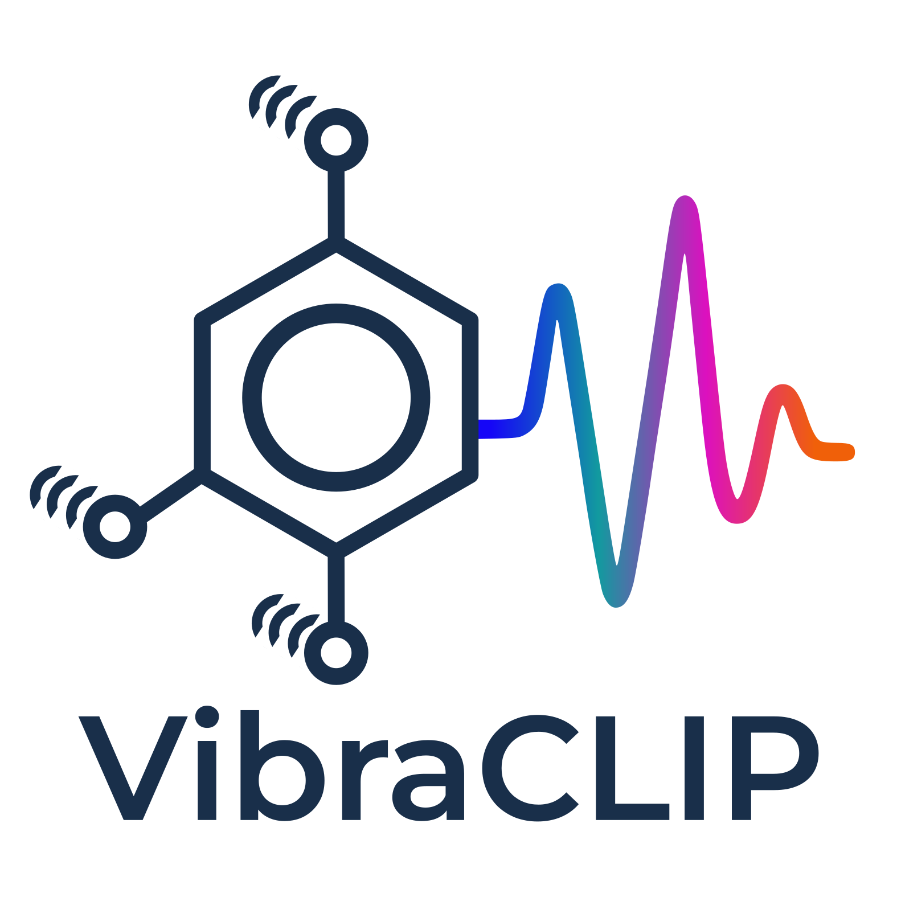

<div align="center">

<h1 align="center"></h1>

<a href="https://pytorch.org/get-started/locally/"></a>
<a href="https://pytorchlightning.ai/"></a>
<a href="https://hydra.cc/"></a>
[](https://www.rdkit.org/)
[]()

</div>

## 📌 Introduction

VibraCLIP is a multi-modal framework, inspired by the CLIP model [1], that integrates molecular graph representations with infrared (IR) and Raman spectra, from the QM9S Dataset [2], leveraging advanced machine learning to capture complex relationships between molecular structures and vibrational spectroscopy. By aligning these diverse data modalities in a shared representation space, VibraCLIP enables precise molecular characterization, bridging the gap between spectral data and molecular interpretation.

## ⚡ Installation
After installing [conda](http://conda.pydata.org/), run the following commands to create a new [environment](https://conda.io/docs/user-guide/tasks/manage-environments.html)
named `vibraclip_cpu/gpu` and install the dependencies.

```bash
conda env create -f env_cpu.yml
conda activate vibraclip_gpu
```

We recommend setting the following environment variable in the `.bashrc` file:

```bash
export PYTHONPATH=$PYTHONPATH:/home/{YOUR_PATH}
```

Substitute `{YOUR_PATH}` to the path where the `VibraCLIP` repository is cloned.

## 🚀 Quickstart

### Generate LMDB file
To generate the `LMDB` file, first you need to place a pickle file in the `data` folder with all the raw information inside. We provide both the pickle file and the generation script in the `scripts` folder, so the user can either use our pickle file to re-generate the lmdb file or create a new pickle file from the original QM9S dataset[2].

Then, after getting the pickle file, the user needs to generate the `LMDB` file using the `create_lmdb.py` script as follows:

```python
from preprocessing.graph import QM9Spectra

# Paths
data_path = "./data/qm9s_ir_raman.pkl"
db_path = "./data/qm9s_ir_raman"

# LMDB Generator
extractor = QM9Spectra(
    data_path=data_path,  # Path where the pickle file is placed
    db_path=db_path,      # Path where the LMDB file will be located
    spectra_dim=1750,     # To interpolate both IR and Raman spectra to a given dimension
)

# Run
extractor.get_lmdb()
# extractor.get_pickle()
```

This method automatically generates the molecular graph representations and stores the processed IR and Raman spectra inside the [PyG](https://pytorch-geometric.readthedocs.io/en/latest/) `Data` object with other metadata.

### Training VibraCLIP
To train VibraCLIP, we use [hydra](https://hydra.cc/) to configure the model's hyperparameters and training settings through a `config.yaml` file stored in the `configs` folder. We provide the general configuration file `config.yaml` for pre-training the model and the `config_ft.yaml` for the fine-tuning stage with the QM9S external dataset from [PubChem](https://pubchem.ncbi.nlm.nih.gov/). We refer the user to check all the hyperparameters used in our work within the yaml files.

VibraCLIP considers different scenarios for training, depending on the modalities:

To train VibraCLIP only on the Graph-IR relationship, use the following command:

```bash
python main_ir.py --config-name config.yaml
```

Then, to train VibraCLIP on the Graph-IR-Raman relationships, use the following command:

```bash
python main_ir_raman.py --config-name config.yaml
```

Note that both models can be trained using the same `config.yaml` file.

The model's checkpoint files are stored automatically in the `checkpoints` folder and the `RetrievalAccuracy` callbacks will save a pickle file in the `outputs` folder for further analysis of the model's performance in the test dataset.

We strongly recommend to use [wandb](https://docs.wandb.ai/) platform to track the training/validation/testing loss functions during the execution.

### Hyperparameter Optimization
For `HPO` we use [optuna](https://optuna.readthedocs.io/en/stable/) python library to optimize both the model's architecture and the training hyperparameters. Since, VibraCLIP is a multi-modal framework we used a multi-objective strategy optimization where both the validation loss referred to the graph representation and also the validation loss from the spectra. We recommend the user to look at the `main_optuna.py` script before launching an `HPO` experiment.

### Evaluate VibraCLIP performance
We provide the jupyter notebooks, along with the pickle files with all the testing data, in the folder `notebooks` to analyze and visualize the performance of VibraCLIP to get the same plots that are in the publication manuscript.

- `metrics.ipynb`: To plot the retrieval accuracy plot of the test set and chemical spaces based on TopK.
- `plots.ipynb`: The actual retrieval accuracy plots from the publication for better comparison.

### Makefile
Inside the `Makefile` there are a few handy commands to streamline cleaning tasks.

```bash
make wandb-sync  # In case of using wandb offline

make clean-data  # To remove the processed folder from PyG

make clean-all   # To clean __pycache__ folders and unnecessary things
```

## ❤️  Acknowledgements
The authors thank the Institute of Chemical Research of Catalonia (ICIQ) Summer Fellow Program for its support. We also acknowledge the Department of Research and Universities of the Generalitat de Catalunya for funding through grant (reference: SGR-01155). Additionally, we are grateful to Dr. Georgiana Stoica and Mariona Urtasun from the ICIQ Research Support Area (Spectroscopy and Material Characterization Unit) for their valuable assistance. Computational resources were provided by the Barcelona Supercomputing Center (BSC), which we gratefully acknowledge.

## ⚖️  License
`VibraCLIP` is released under the [MIT]() license.

## 📄 Citing `VibraCLIP`

If you use this codebase in your work, please consider citing:

```bibtex
@article{vibraclip,
    title = {Multi-Modal Contrastive Learning for Chemical Structure Elucidation with VibraCLIP},
    author = {Pau Rocabert-Oriols, Nuria López, Javier Heras-Domingo},
    journal = {submitted},
    year = {2025},
    doi = {},
}
```

## References
<a id="1">[1]</a>
Radford, A., Kim, J. W., Hallacy, C., Ramesh, A., Goh, G., Agarwal, S., Sutskever, I.,
Learning transferable visual models from natural language supervision. ICML, 2021, 8748-8763, [URL](http://proceedings.mlr.press/v139/radford21a)

<a id="2">[2]</a>
Zou, Z., Zhang, Y., Liang, L., Wei, M., Leng, J., Jiang, J., Hu, W., A deep learning model for predicting selected organic molecular spectra. Nature Computational Science, 2023, 3(11), 957-964, [URL](https://www.nature.com/articles/s43588-023-00550-y)
